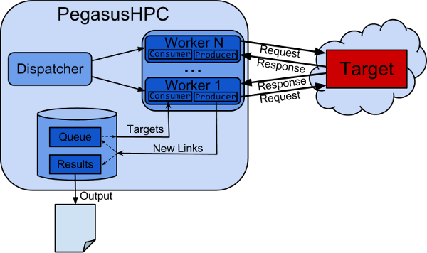

PegasusHPC is a High Performance Crawler
----------
"PegasusHPC is a High Performance Crawler" is a web crawler aimed at allowing a high throughput spidering and scalability by menas of parallel computing and optimized memory usage. Go to the downloads section to get the last release.

Usage
-----

`$ java -xmX4000m -t {target} -nt {#threads} -max {#URIs} [-ipBased | -domainBased]`

    -t {target} Complete URI of the targeted host i.e. http://google.com
    -nt {#threads} Number of threads to create. Suggested between 500-10000.
    -max {#URIs} Number of unique URIs to crawl.
    -[ipBased] to follow links to different domain of the same server.
    -[domainBased] to target a specific host or path
    -h prints this menu

Requirements
---------
`Java 1.7`

Example
-------
`java -Xmx4000m -jar pegaushpc.jar -t http://youtube.com/ -nt 1000 -ipBased -max 2000`

Note: Do not choose a number of threads > 100 when using less than 4GB of Heap space.

Links
-------
http://guifreruiz.blogspot.com/2013/03/PegasusHPC-is-a-high-performance-crawler.html

http://guifreruiz.blogspot.com/2013/05/security-testing-at-scale-with-PegasusHPC.html

Bugs & Contact
-----
Feel free to mail me with any problem, bug, suggestions or fixes at:
Guifre Ruiz <guifre.ruiz@owasp.org>

License
-------
Code licensed under the GPL v3.0.

